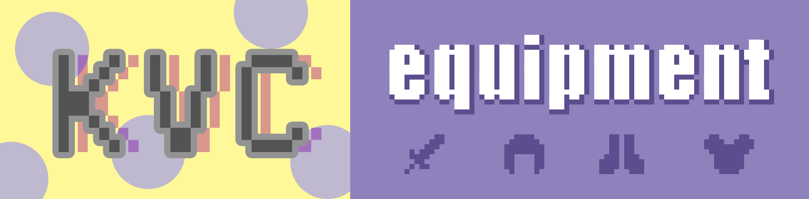
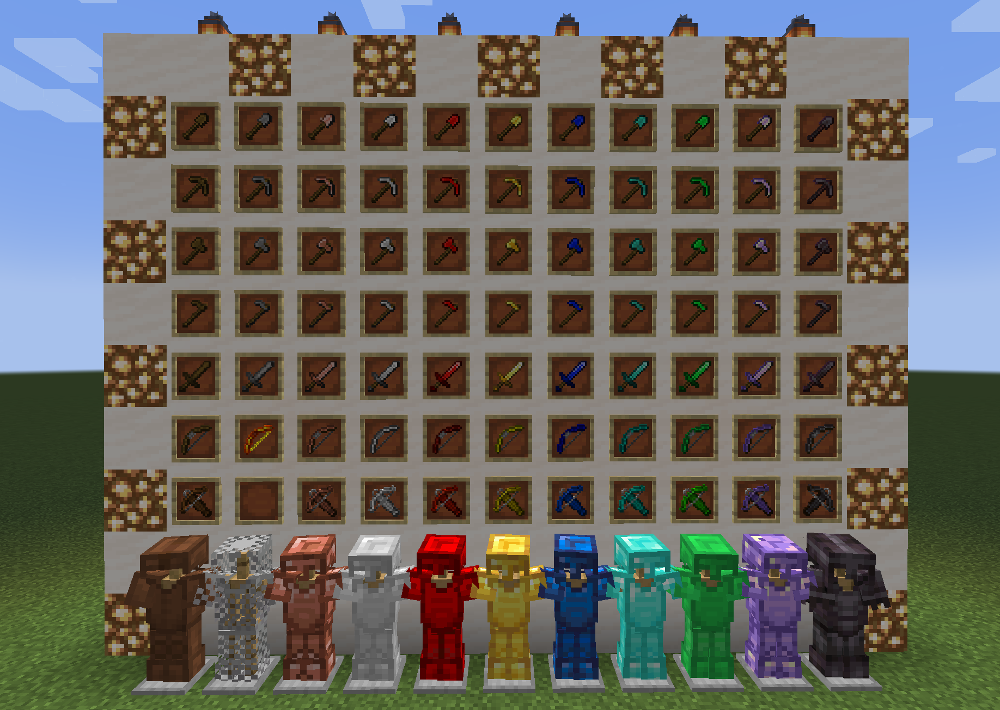

# Kevyn's Vanilla Complement：Equipment

## About Kevyn's Vanilla Complement

Do you love the vanilla Minecraft as much as I do? And have you sometimes thought that Mojang just forgot about some should-be-there items and blocks,  or wanted various interesting features in many small mods to be systematically integrated, or further more, hoped to improve the configurability of the vanilla Minecraft?

This project: **Kevyn's Vanilla Complement** (KVC),  is a Fabric mod project that I started with a whim recently, Aiming to supplement some contents to the vanilla MC. And I want to obey the following design rules: 

- Respect and follow the vanilla style and design concepts
- Create new things from the old things
- Good systematicness and integration
- High configurability

Mods under the KVC project may not make drastic changes to MC, but they will incrementally enrich the content of the vanilla game. Moreover, I hope the add-ons under KVC project can be harmonious, consistent, and interactive with vanilla minecraft, give to you who like MC flavor. I also hope to get your support and encouragement.

This mod, KVCEquipment, is the first mod of the KVC project. In my design mind map, **KVCEquipment** is responsible for completing the vanilla equipment set. In the future, it will take improving the equipment system and increasing the game-play joys as the update goal. In addition, there will be other mods worth looking forward to in the same project: 

- KVCBuildingBlocks
- KVCFood
- KVCCreatures
- KVCServerUtils
- And more

The source code of KVC project is all open source on GitHub, and the releases will also be post on Curseforge and MCBBS forum. Because the project is at a very initial stage, during this period, if you encounter problems with any mods under KVC project, please give me feedback at first time.

The last part of the introduction is about recruitment. If you agree with my design concept and are interested in MC mod development, you are welcome to provide suggestions, textures, models, recipes, codes, etc. to KVC project. feel free to send me a message if you want (there is no team or community yet, but I hope there will be one in the future), Let's improve our world together.

## About this mod

**KVCEquipment** is responsible for complementing the equipment system of vanilla MC. At present, the items and features of the mod are as follows:

- redstone, lapis, emerald, copper and amethyst armors.
- redstone, lapis, emerald, copper, amethyst tools.
- redstone, lapis, emerald, copper and amethyst sword, bow and crossbow.
- a flame bow
- iron, gold, diamond, netherite bow and crossbow.
- rewrite the original bow and crossbow to make it more consistent and extensible
- a equipment value (hand feeling) system, all properties can be configured (currently being improved)
- rich configuration file, all values can be adjusted, and more settings will be added.
- all values of the original equipment can also be adjusted: D

And some of my future plan:

- more equipment 
- better balance
- better equipment value system, more differentiated design
- more settings will be added to the config, such as bow-pulling-deceleration, bow-range, etc.
- original monsters can be equipped with new armors and weapons to improve KVC&Vanilla's integration and consistency
- More interesting ideas, such as the arrow shoot by redstone bow can emit redstone power on it's way
- Or interesting ideas from you?

This mod is one of my early works, there are still many imperfections, and my development skills are not mature as well. If you are going to add this mod to your game, please pay attention to risks, and remember to feedback problems, update in time, and give me some support or encouragement, thx
